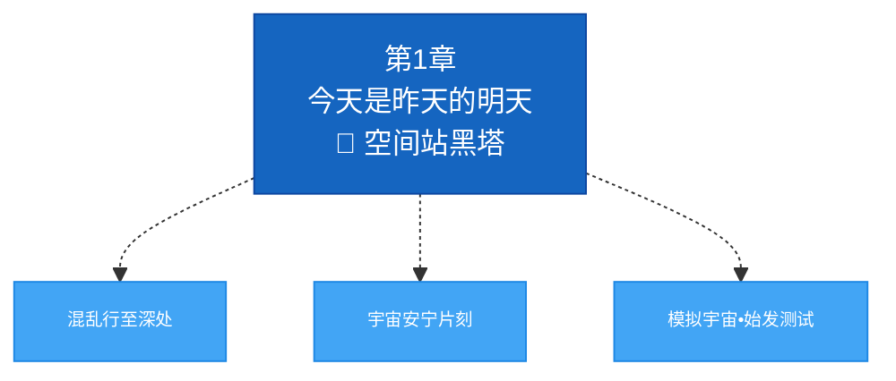
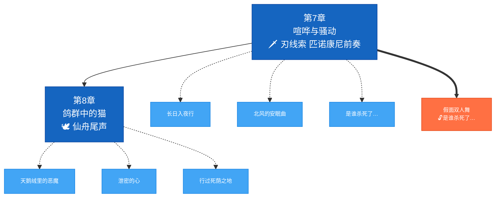
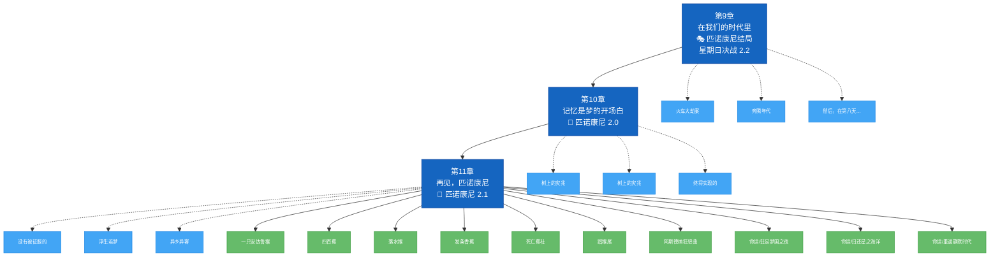
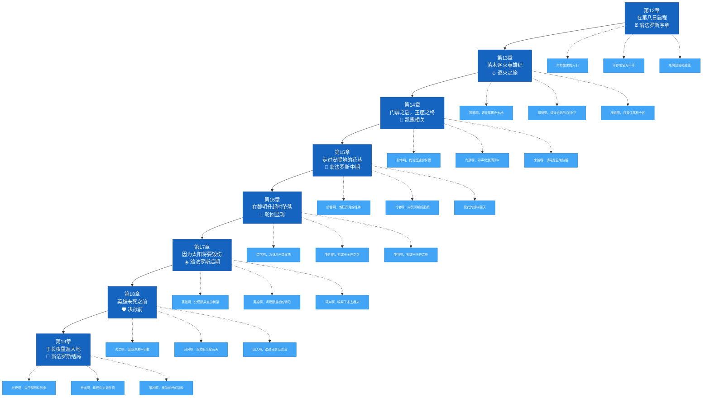
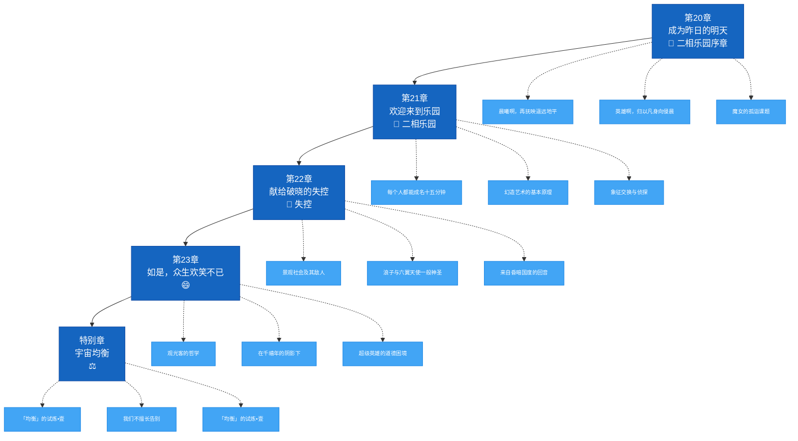

# 任务时序详细图（按弧线分）

> - 蓝色实线箭头 `-->` = 主线章节顺序
> - 蓝色虚线箭头 `-.->` = 章节内主线关键任务
> - 橙色粗箭头 `==>` = 同行任务（注明解锁前置）
> - 绿色箭头 `-->` = 开拓续闻

---

## 空间站「黑塔」

## 雅利洛-Ⅵ / 贝洛伯格

```mermaid
flowchart TD

    classDef mainCh   fill:#1565C0,stroke:#0D47A1,color:#fff
    classDef mainTask fill:#42A5F5,stroke:#1E88E5,color:#fff,font-size:10px
    classDef comp     fill:#FF7043,stroke:#E64A19,color:#fff,font-size:10px
    classDef cont     fill:#66BB6A,stroke:#43A047,color:#fff,font-size:10px

    ch02["第2章<br/>于枯索的冬夜里<br/>❄️ 贝洛伯格前期"]:::mainCh
    ch03["第3章<br/>于曈昽的骄阳下<br/>💀 贝洛伯格结局<br/>可可利亚↓布洛妮娅↑"]:::mainCh

    ch02 --> ch03

    %% ── 主线关键任务（每章首尾）──
    m1010002["激「冻」人心的大冒险"]:::mainTask
    ch02 -.-> m1010002
    m1010403["她等待刀尖已经太久"]:::mainTask
    ch02 -.-> m1010403
    m1011001["我们不擅长告别"]:::mainTask
    ch02 -.-> m1011001
    m1011002["在屋外的黑暗中洗涤"]:::mainTask
    ch03 -.-> m1011002
    m1011301["星星是冰冷的玩具"]:::mainTask
    ch03 -.-> m1011301
    m1011503["静静的星河"]:::mainTask
    ch03 -.-> m1011503

    %% ── 同行任务 ──
    c知名不具_ch02["知名不具\n🔓我们不擅长告别"]:::comp
    ch02 ==> c知名不具_ch02
    c阴差阳错_ch02["阴差阳错\n🔓她等待刀尖已经太久"]:::comp
    ch02 ==> c阴差阳错_ch02
    c老矿头的宝贝_ch02["老矿头的宝贝\n🔓躺在铁锈中"]:::comp
    ch02 ==> c老矿头的宝贝_ch02
    c寻药溯源_ch02["寻药溯源\n🔓我们不擅长告别"]:::comp
    ch02 ==> c寻药溯源_ch02
    c小虎克的宝贝_ch02["小虎克的宝贝\n🔓我们不擅长告别"]:::comp
    ch02 ==> c小虎克的宝贝_ch02
    c宇宙幻觉之夜_ch03["宇宙幻觉之夜\n🔓静静的星河"]:::comp
    ch03 ==> c宇宙幻觉之夜_ch03
    c虎克的礼物_ch03["虎克的礼物\n🔓兵士们默默无言"]:::comp
    ch03 ==> c虎克的礼物_ch03
    c难得有情_其一_ch03["难得有情•其一\n🔓静静的星河"]:::comp
    ch03 ==> c难得有情_其一_ch03
    c难得有情_其二_ch03["难得有情•其二\n🔓静静的星河"]:::comp
    ch03 ==> c难得有情_其二_ch03
    c风雪免疫_ch03["风雪免疫\n🔓兵士们默默无言"]:::comp
    ch03 ==> c风雪免疫_ch03
    c时光列车_ch03["时光列车\n🔓静静的星河"]:::comp
    ch03 ==> c时光列车_ch03
    c只是孩子_ch03["只是孩子\n🔓静静的星河"]:::comp
    ch03 ==> c只是孩子_ch03
    c比雪原更遥远_ch03["比雪原更遥远\n🔓静静的星河"]:::comp
    ch03 ==> c比雪原更遥远_ch03
    c我的挚爱_我的血肉_ch03["我的挚爱，我的血肉\n🔓静静的星河"]:::comp
    ch03 ==> c我的挚爱_我的血肉_ch03

    %% ── 开拓续闻 ──
    g庸人自扰_ch03["庸人自扰"]:::cont
    ch03 --> g庸人自扰_ch03
    g天才群星闪耀时_ch03["天才群星闪耀时"]:::cont
    ch03 --> g天才群星闪耀时_ch03

```

## 仙舟「罗浮」前期

```mermaid
flowchart TD

    classDef mainCh   fill:#1565C0,stroke:#0D47A1,color:#fff
    classDef mainTask fill:#42A5F5,stroke:#1E88E5,color:#fff,font-size:10px
    classDef comp     fill:#FF7043,stroke:#E64A19,color:#fff,font-size:10px
    classDef cont     fill:#66BB6A,stroke:#43A047,color:#fff,font-size:10px

    ch04["第4章<br/>乘槎驭风仙窟游<br/>⚓ 仙舟前期"]:::mainCh
    ch05["第5章<br/>云树百丈蔽重楼<br/>🌳 建木灾异"]:::mainCh
    ch06["第6章<br/>劫波渡尽战云收<br/>⚔️ 幻胧被击败"]:::mainCh

    ch04 --> ch05
    ch05 --> ch06

    %% ── 主线关键任务（每章首尾）──
    m1020101["旅进青霄，不速之邀"]:::mainTask
    ch04 -.-> m1020101
    m1020601["迴星周旋，未卜知先"]:::mainTask
    ch04 -.-> m1020601
    m1021101["茸客鸣呦，玉角盘虬"]:::mainTask
    ch04 -.-> m1021101
    m1021201["金鼎灵树，穷途梼杌"]:::mainTask
    ch05 -.-> m1021201
    m1021401["得其雨露，安其壤土"]:::mainTask
    ch05 -.-> m1021401
    m1021601["仙骸成空，大劫有终"]:::mainTask
    ch05 -.-> m1021601
    m1021702["安灵布奠，天清路远"]:::mainTask
    ch06 -.-> m1021702

    %% ── 同行任务 ──
    c譬如朝露_ch04["譬如朝露\n🔓茸客鸣呦，玉角盘虬"]:::comp
    ch04 ==> c譬如朝露_ch04
    c异邦骑士_ch04["异邦骑士\n🔓茸客鸣呦，玉角盘虬"]:::comp
    ch04 ==> c异邦骑士_ch04
    c忧思难忘_ch04["忧思难忘\n🔓茸客鸣呦，玉角盘虬"]:::comp
    ch04 ==> c忧思难忘_ch04
    c霜刃一试_ch04["霜刃一试\n🔓茸客鸣呦，玉角盘虬"]:::comp
    ch04 ==> c霜刃一试_ch04
    c因为我已触碰过天空_ch05["因为我已触碰过天空\n🔓有龙矫矫，其渊渺渺"]:::comp
    ch05 ==> c因为我已触碰过天空_ch05
    c陌生女人的来信_ch05["陌生女人的来信\n🔓有龙矫矫，其渊渺渺"]:::comp
    ch05 ==> c陌生女人的来信_ch05
    c全面回忆_ch06["全面回忆\n🔓安灵布奠，天清路远"]:::comp
    ch06 ==> c全面回忆_ch06
    c龙返其乡_ch06["龙返其乡\n🔓安灵布奠，天清路远"]:::comp
    ch06 ==> c龙返其乡_ch06
    c云无留迹_ch06["云无留迹\n🔓安灵布奠，天清路远"]:::comp
    ch06 ==> c云无留迹_ch06

    %% ── 开拓续闻 ──
    g未来市场_序_ch06["未来市场•序"]:::cont
    ch06 --> g未来市场_序_ch06
    g未来市场_其二_ch06["未来市场•其二"]:::cont
    ch06 --> g未来市场_其二_ch06
    g未来市场_其一_ch06["未来市场•其一"]:::cont
    ch06 --> g未来市场_其一_ch06
    g游园惊梦_ch06["游园惊梦"]:::cont
    ch06 --> g游园惊梦_ch06
    g故客重游_演武天舟_ch06["故客重游，演武天舟"]:::cont
    ch06 --> g故客重游_演武天舟_ch06
    g狴犴吠狂_妙语生香_ch06["狴犴吠狂，妙语生香"]:::cont
    ch06 --> g狴犴吠狂_妙语生香_ch06
    g锷击刃鸣_止戈罢兵_ch06["锷击刃鸣，止戈罢兵"]:::cont
    ch06 --> g锷击刃鸣_止戈罢兵_ch06
    g神锋有归_众议难违_ch06["神锋有归，众议难违"]:::cont
    ch06 --> g神锋有归_众议难违_ch06
    g衔令来使_真意难识_ch06["衔令来使，真意难识"]:::cont
    ch06 --> g衔令来使_真意难识_ch06
    g授剑传行_腾然流星_ch06["授剑传行，腾然流星"]:::cont
    ch06 --> g授剑传行_腾然流星_ch06
    g双生_ch06["双生"]:::cont
    ch06 --> g双生_ch06
    g绥园聚首_其一_ch06["绥园聚首•其一"]:::cont
    ch06 --> g绥园聚首_其一_ch06

```

## 仙舟「罗浮」后期

## 匹诺康尼

## 翁法罗斯

## 二相乐园

