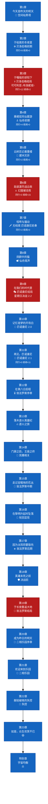

# 任务时序概览图（章节级）

> 节点颜色：蓝色=普通章节，红色=关键状态变化章节（布洛妮娅接任/幻胧击败/星期日决战等）
> 每个节点标注了该章节解锁的同行×N 和续闻×N 数量

```mermaid
flowchart TD

    %% ── 章节节点样式 ──────────────────────────────────────────
    classDef main      fill:#1565C0,stroke:#0D47A1,color:#fff,font-size:11px
    classDef mainKey   fill:#B71C1C,stroke:#7F0000,color:#fff,font-size:11px
    classDef companion fill:#E65100,stroke:#BF360C,color:#fff,font-size:10px
    classDef continua  fill:#2E7D32,stroke:#1B5E20,color:#fff,font-size:10px

    %% ── 主线章节节点 ──────────────────────────────────────────
    %% == 空间站「黑塔」 ==
    ch01["第1章<br/>今天是昨天的明天<br/>🌌 空间站黑塔"]:::main

    %% == 雅利洛-Ⅵ / 贝洛伯格 ==
    ch02["第2章<br/>于枯索的冬夜里<br/>❄️ 贝洛伯格前期<br/><small>同行×9 续闻×0</small>"]:::main
    ch01 --> ch02
    ch03["第3章<br/>于曈昽的骄阳下<br/>💀 贝洛伯格结局<br/>可可利亚↓布洛妮娅↑<br/><small>同行×12 续闻×2</small>"]:::mainKey
    ch02 --> ch03

    %% == 仙舟「罗浮」前期 ==
    ch04["第4章<br/>乘槎驭风仙窟游<br/>⚓ 仙舟前期<br/><small>同行×4 续闻×0</small>"]:::main
    ch03 --> ch04
    ch05["第5章<br/>云树百丈蔽重楼<br/>🌳 建木灾异<br/><small>同行×2 续闻×0</small>"]:::main
    ch04 --> ch05
    ch06["第6章<br/>劫波渡尽战云收<br/>⚔️ 幻胧被击败<br/><small>同行×3 续闻×15</small>"]:::mainKey
    ch05 --> ch06

    %% == 仙舟「罗浮」后期 ==
    ch07["第7章<br/>喧哗与骚动<br/>🗡️ 刃线索 匹诺康尼前奏<br/><small>同行×2 续闻×0</small>"]:::main
    ch06 --> ch07
    ch08["第8章<br/>鸽群中的猫<br/>🕊️ 仙舟尾声"]:::main
    ch07 --> ch08

    %% == 匹诺康尼 ==
    ch09["第9章<br/>在我们的时代里<br/>🎭 匹诺康尼结局<br/>星期日决战 2.2"]:::mainKey
    ch08 --> ch09
    ch10["第10章<br/>记忆是梦的开场白<br/>🌙 匹诺康尼 2.0"]:::main
    ch09 --> ch10
    ch11["第11章<br/>再见，匹诺康尼<br/>🎪 匹诺康尼 2.1<br/><small>同行×0 续闻×11</small>"]:::main
    ch10 --> ch11

    %% == 翁法罗斯 ==
    ch12["第12章<br/>在第八日启程<br/>⏳ 翁法罗斯序章"]:::main
    ch11 --> ch12
    ch13["第13章<br/>落木逐火英雄纪<br/>🔥 逐火之旅"]:::main
    ch12 --> ch13
    ch14["第14章<br/>门扉之启，王座之终<br/>👑 凯撒相关"]:::main
    ch13 --> ch14
    ch15["第15章<br/>走过安眠地的花丛<br/>🌸 翁法罗斯中期"]:::main
    ch14 --> ch15
    ch16["第16章<br/>在黎明升起时坠落<br/>🔄 轮回显现"]:::main
    ch15 --> ch16
    ch17["第17章<br/>因为太阳将要毁伤<br/>☀️ 翁法罗斯后期"]:::main
    ch16 --> ch17
    ch18["第18章<br/>英雄未死之前<br/>🛡️ 决战前"]:::main
    ch17 --> ch18
    ch19["第19章<br/>于长夜重返大地<br/>🌅 翁法罗斯结局"]:::mainKey
    ch18 --> ch19

    %% == 二相乐园 ==
    ch20["第20章<br/>成为昨日的明天<br/>🎠 二相乐园序章"]:::main
    ch19 --> ch20
    ch21["第21章<br/>欢迎来到乐园<br/>🎡 二相乐园"]:::main
    ch20 --> ch21
    ch22["第22章<br/>献给破晓的失控<br/>🌅 失控"]:::main
    ch21 --> ch22
    ch23["第23章<br/>如是，众生欢笑不已<br/>😄"]:::main
    ch22 --> ch23
    ch99["特别章<br/>宇宙均衡<br/>⚖️"]:::main
    ch23 --> ch99

```