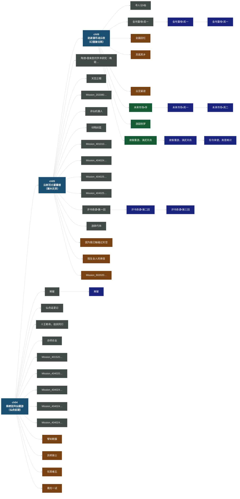
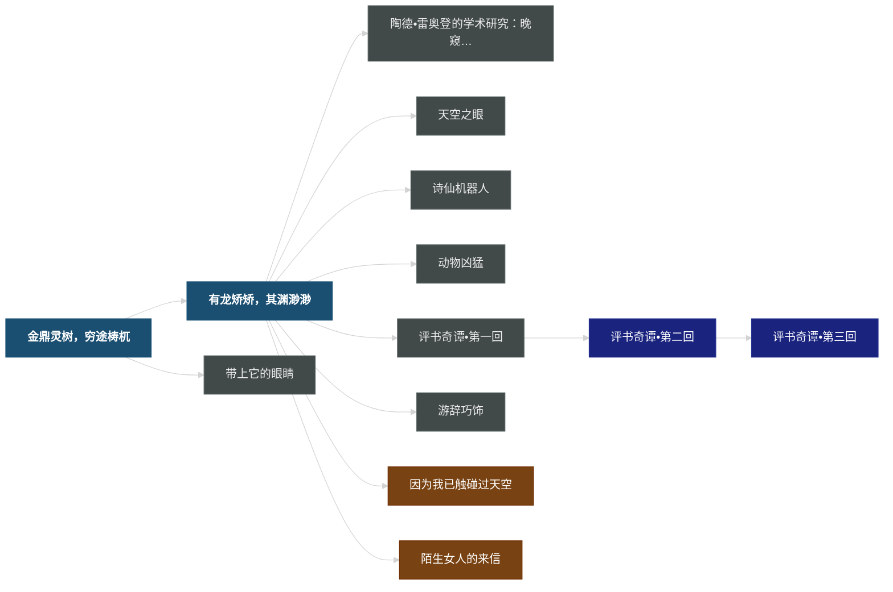
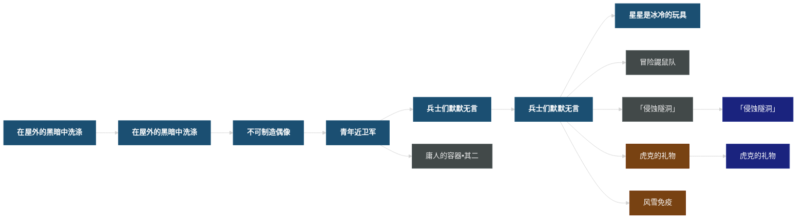

# 任务时序 Mermaid 图

## 最终数据结构方案

### 核心设计原则

游戏本身的任务树结构已经编码了完整的时序信息，我们直接利用：
- `TakeParam[MultiSequence]` = 前置任务 ID → 时效起点
- `NextTrackMainMission` = 下一个任务 → 任务链
- `Type` = Main/Companion/Gap/Branch/Daily → 任务类别

### 任务节点（用于 entity_pipeline 注入 temporal context）

```json
{
  "mission_id": 1021501,
  "name": "有龙矫矫，其渊渺渺",
  "type": "Main",
  "chapter_anchor": "ch05",
  "arc_anchor": "arc_main_luofu",
  "display_priority": 1021501,
  "prereq_mission_ids": [1021401],
  "next_main_mission": 1021702,
  "unlocks": {
    "companion": [
      {"id": 6020101, "name": "因为我已触碰过天空"},
      {"id": 6020201, "name": "陌生女人的来信"}
    ],
    "branch": [
      {"id": 2020901, "name": "诗仙机器人"},
      {"id": 2021601, "name": "动物凶猛"},
      {"id": 8002211, "name": "评书奇谭•第一回",
       "chain": ["评书奇谭•第二回", "评书奇谭•第三回"]},
      {"id": 2020201, "name": "陶德•雷奥登的学术研究：晚窥青囊"}
    ],
    "gap": []
  }
}
```

### 实体关系时间标注（entity_pipeline 新 schema）

```json
{
  "entity": "可可利亚",
  "relation": "holds_title",
  "target": "贝洛伯格大守护者",
  "temporal": {
    "anchor":               "ch03",
    "position":             "during",
    "valid_from":           null,
    "valid_until":          "ch03",
    "valid_until_mission":  1011503,
    "valid_until_name":     "静静的星河",
    "precision":            "mission_level",
    "raw_evidence":         "可可利亚在「静静的星河」中身亡，由女儿布洛妮娅·兰德接任大守护者"
  },
  "reliability": "confirmed"
}

{
  "entity": "布洛妮娅·兰德",
  "relation": "holds_title",
  "target": "贝洛伯格大守护者",
  "temporal": {
    "anchor":              "ch03",
    "position":            "after",
    "valid_from":          "ch03",
    "valid_from_mission":  1011503,
    "valid_from_name":     "静静的星河",
    "valid_until":         null,
    "valid_until_mission": null,
    "precision":           "mission_level",
    "raw_evidence":        "主线结局后布洛妮娅继任大守护者，后续续闻中作为守护者领导贝洛伯格"
  },
  "reliability": "confirmed"
}
```

### 三级时间系统总结

| 锚点级别 | 用于 | 精度 | 示例 |
|---------|------|------|------|
| `epoch_*` | 远古历史、星神纪元 | 数百年 | `epoch_yinyue` |
| `arc_*` | lore/书籍/角色故事 | 数月~1年 | `arc_main_luofu` |
| `ch_*` | 主线/续闻场景（当无更精确信息）| 数周 | `ch05` |
| `mission_level` | 关键状态变化（`valid_until_mission`）| 单个任务 | `m1011503` |

### 对话来源可信度

```json
{
  "scene_metadata": {
    "mission_id": 1021501,
    "mission_name": "有龙矫矫，其渊渺渺",
    "mission_type": "Main",
    "chapter_anchor": "ch05",
    "narrative_layer": "L1",
    "reliability": "confirmed"
  }
}
// narrative_layer 规则：
// L1 confirmed  = Main 类型主线直接叙事
// L2 historical = Gap/续闻（角色视角回顾）
// L3 character  = Companion 同行任务（角色自述）
// L4 speculation = 已知含记忆重建的 Companion 场景
// L5 fictional  = Branch 中明确标注为世界内虚构的任务
```

---

## Level 1：弧线总览图（仿截图1）

> 展示章节链 + 每章结束后解锁的同行/续闻/世界任务





---

## Level 1：贝洛伯格弧（额外示例）

```mermaid
%%{init: {'theme':'dark','flowchart':{'curve':'basis'}}}%%
flowchart LR

    classDef mainCh   fill:#1B4F72,stroke:#1A5276,color:#fff,font-weight:bold
    classDef companion fill:#784212,stroke:#6E2C00,color:#fff
    classDef continuance fill:#145A32,stroke:#0B5345,color:#fff
    classDef branch    fill:#424949,stroke:#616A6B,color:#eee
    classDef chain     fill:#1A237E,stroke:#283593,color:#fff

    %% ═══ 主线章节链 ═══════════════════════════════
    ch02["ch02
于枯索的冬夜里
（贝洛伯格前期）"]:::mainCh
    ch03["ch03
于曈昽的骄阳下
（可可利亚→布洛妮娅）"]:::mainCh
    ch02 --> ch03

    %% ═══ 各章节解锁的任务（完成最后一个主线任务后）══
    %% --- ch02 解锁 ---
    s2000103["千面变相"]:::branch
    ch02 --> s2000103
    s2000102["千面变相"]:::chain
    s2000103 --> s2000102
    s2000104["触不可及"]:::branch
    ch02 --> s2000104
    s2000105["触不可及"]:::chain
    s2000104 --> s2000105
    s2000112["向导佯谬"]:::branch
    ch02 --> s2000112
    s2000113["向导佯谬"]:::chain
    s2000112 --> s2000113
    s2000116["安魂弥撒"]:::branch
    ch02 --> s2000116
    s2010701["拳台即戏台•上"]:::branch
    ch02 --> s2010701
    s2010708["拳台即戏台•下"]:::chain
    s2010701 --> s2010708
    s2010720["角斗士"]:::chain
    s2010708 --> s2010720
    s4030004["模拟宇宙•其二"]:::branch
    ch02 --> s4030004
    s4040117["Mission_404011…"]:::branch
    ch02 --> s4040117
    s4040118["Mission_404011…"]:::branch
    ch02 --> s4040118
    s2000201["知名不具"]:::companion
    ch02 --> s2000201
    s2000202["知名不具"]:::chain
    s2000201 --> s2000202
    s2000208["裂界征兆"]:::chain
    s2000202 --> s2000208
    s2010702["寻药溯源"]:::companion
    ch02 --> s2010702
    s2010705["小虎克的宝贝"]:::companion
    ch02 --> s2010705
    s2010706["小虎克的宝贝"]:::chain
    s2010705 --> s2010706

    %% --- ch03 解锁 ---
    s2011101["失控"]:::branch
    ch03 --> s2011101
    s2011409["庸人的容器•其三"]:::branch
    ch03 --> s2011409
    s2011501["当生意来敲门"]:::branch
    ch03 --> s2011501
    s2011502["Mission_201150…"]:::branch
    ch03 --> s2011502
    s2011901["漫藏诲盗•其一"]:::branch
    ch03 --> s2011901
    s2011906["致艾丽斯"]:::chain
    s2011901 --> s2011906
    s4040052["Mission_404005…"]:::branch
    ch03 --> s4040052
    s4040114["Mission_404011…"]:::branch
    ch03 --> s4040114
    s4040122["Mission_404012…"]:::branch
    ch03 --> s4040122
    s4040124["Mission_404012…"]:::branch
    ch03 --> s4040124
    s4040126["Mission_404012…"]:::branch
    ch03 --> s4040126
    s4040130["Mission_404013…"]:::branch
    ch03 --> s4040130
    s4140123["Mission_414012…"]:::branch
    ch03 --> s4140123
    s8012101["地城游记•其一"]:::branch
    ch03 --> s8012101
    s8012102["地城游记•其二"]:::chain
    s8012101 --> s8012102
    s8012103["地城游记•其三"]:::chain
    s8012102 --> s8012103
    s8012106["Mission_801210…"]:::branch
    ch03 --> s8012106
    s8012107["Mission_801210…"]:::branch
    ch03 --> s8012107
    s8015201["Mission_801520…"]:::branch
    ch03 --> s8015201
    s8015202["斗技者"]:::branch
    ch03 --> s8015202
    s8015203["Mission_801520…"]:::branch
    ch03 --> s8015203
    s8016301["虚境味探"]:::branch
    ch03 --> s8016301
    s8016302["虚境味探"]:::chain
    s8016301 --> s8016302
    s8016303["虚境味探"]:::chain
    s8016302 --> s8016303
    s8016305["Mission_801630…"]:::branch
    ch03 --> s8016305
    s8021201["战意狂潮"]:::branch
    ch03 --> s8021201
    s8021202["Mission_802120…"]:::branch
    ch03 --> s8021202
    s8024201["老朋友，新朋友？"]:::branch
    ch03 --> s8024201
    s8026201["寒腿叔叔的小店·第一单"]:::branch
    ch03 --> s8026201
    s8026202["寒腿叔叔的小店·第二单"]:::chain
    s8026201 --> s8026202
    s8026203["寒腿叔叔的小店·第三单"]:::chain
    s8026202 --> s8026203
    s8026208["Mission_802620…"]:::branch
    ch03 --> s8026208
    s8026209["Mission_802620…"]:::branch
    ch03 --> s8026209
    s2000801["宇宙幻觉之夜"]:::companion
    ch03 --> s2000801
    s2010905["难得有情•其一"]:::companion
    ch03 --> s2010905
    s2011402["时光列车"]:::companion
    ch03 --> s2011402
    s2011601["我的挚爱，我的血肉"]:::companion
    ch03 --> s2011601
    s2001001["天才群星闪耀时"]:::continuance
    ch03 --> s2001001
    s2000901["庸人自扰"]:::chain
    s2001001 --> s2000901

```





---

## Level 2：云树百丈蔽重楼 内部结构（仿截图2）

> 展示章节内各主线任务 + 每个任务后解锁的分支链





---

## Level 2：于曈昽的骄阳下 内部结构（贝洛伯格结局章）


